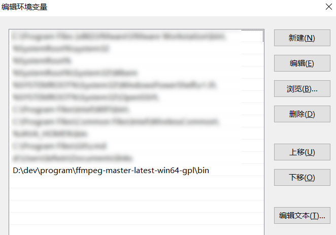
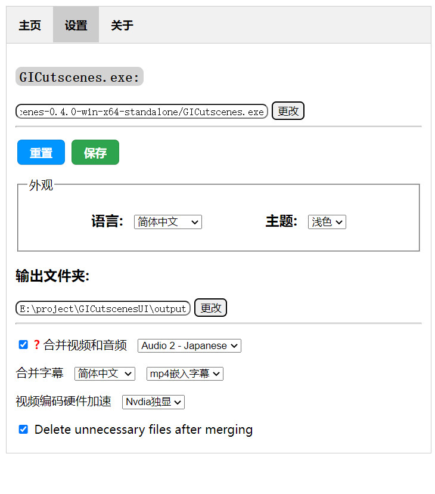

# GI-Cutscenes UI - mod 原神剧情动画导出GUI工具
-- modified by yohsinw

> 本项目为[ToaHartor/GI-cutscenes](https://github.com/ToaHartor/GI-cutscenes)命令行工具的GUI版，fork自[SuperZombi/GICutscenesUI](https://github.com/SuperZombi/GICutscenesUI)，并做一定修改：
> 1. 使用ffmpeg合并视频、音频时，均输出为H264编码(导出原文件为VP9编码)，且可选硬件加速(AMD GPU加速为测试功能，有问题请反馈);
> 2. 合并视频、音频时可选合并多语言字幕；
> 3. 可选择将字幕合并为内挂字幕或内嵌硬字幕。

> PS: 内挂字幕可利用视频编辑软件将字幕流移除，需要播放器支持字幕渲染，如VLC(需手动选择字幕轨道)、Potplayer。
> 内嵌字幕为将字幕以类似水印的方式添加到视频的每帧画面，无法移除，对播放器无要求。

## 合并后效果


## 使用方法

### 1. 下载命令行工具及最新的 `versions.json`文件

下载地址: [ToaHartor/GI-cutscenes](https://github.com/ToaHartor/GI-cutscenes)

推荐下载`standalone`版，如`GICutscenes-xxx-win-x64-standalone.zip`版本，并解压。


**☆☆☆☆☆重要的事情说三遍！！重要的事情说三遍！！重要的事情说三遍！！下载新版[`versions.json`(右键另存为)](https://raw.githubusercontent.com/ToaHartor/GI-cutscenes/main/versions.json)，替换上面解压目录中的同名文件！！**


### 2. 下载安装FFmpeg

下载地址：[FFmpeg build by BtbN](https://github.com/BtbN/FFmpeg-Builds/releases)

推荐下载`gpl`版，如`ffmpeg-master-latest-win64-gpl.zip`, 解压到某一目录，然后将`bin`目录添加到环境变量，如下：



### 3. 下载[GICutscenesUI-mod.exe](https://github.com/yohsinw/GICutscenesUI-mod/releases)

下载`GICutscenesUI-mod.exe`，放入上述命令行工具`GICutscenes.exe`所在目录。

### 4. 下载字幕文件

在`GICutscenes.exe`所在目录打开命令行工具，执行如下命令：

```shell
git clone --depth 1 --filter=blob:none --sparse https://github.com/Dimbreath/GenshinData.git
cd GenshinData
git sparse-checkout set Subtitle
```

所有文件下载完成后，目录结构类似下图：
```
|-- GenshinData
|    |-- Subtitle
|        |-- CHS
|        |-- ...
|-- appsettings.json
|-- GICutscenes.exe
|-- GICutscenesUI-mod.exe
|-- ...
```

### 5. 开始使用

双击`GICutscenesUI-mod.exe`打开GUI程序，切换到`设置`页面，配置参数如下图：



切换到`主页`选项卡，选择过场动画`.usm`文件(`<原神安装目录>\Genshin Impact\Genshin Impact Game\YuanShen_Data\StreamingAssets\VideoAssets\StandaloneWindows64\`)，点击`开始`即可。

## 视频合并硬件加速对比

以爷直面雷神胸口拔刀的过场动画`Cs_200803_ShougunBossPart1_Girl.usm`为例，时长1'54'，合并日文配音+简中字幕。

硬件配置:     

Intel(R) Core(TM) i7-8850H CPU @ 2.60GHz

NVIDIA Quadro P2000 with Max-Q Design 

### 测试结果

| 硬件 | speed(越大越快) | CPU占用 | 耗时(s) |
| :--: | :--: | :--: | :--: |
| 纯CPU | 1.2 | 100% | 94 |
| 集显 | 6.5| ~60% | 22 |
| 独显 | 8.6 | ~50% | 17 |

## 开发

1. 开发环境

Python 3 + eel + JSON-minify

```shell
pip install eel JSON-minify requests PyInstaller
```

2. 字幕文件`GenshinData`下载到项目根目录

3. 打包

```shell
$ cd GICutscenesUI
$ ls
main.py web
$ python -m eel main.py web --onefile -n GICutscenesUI-mod
```